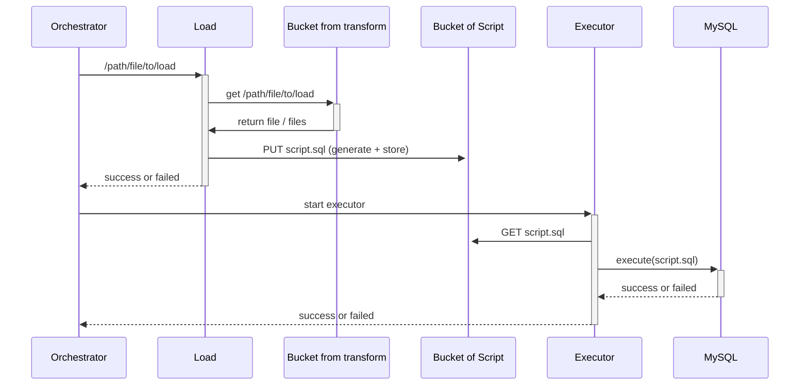

# RIA2-Load
## Fonctionnalités
### Load
- logs structurés (run_id, dataset, table, counts, durée, erreurs)
#### Ecouter de l'orchestrateur
...
#### Chargement des données du bucket.
- Si le Load est relancé, doit-il réécrire le script ou le réutiliser ?

#### Création du script d'insértion
- bulk load vers staging (LOAD DATA INFILE/batching préparé) puis MERGE logique ?
- signature/checksum (hash) + vérification côté Executor

#### Stockage dans un bucket dédier
...
#### Réponse l'orchestrateur.
...

---
#### Solution générée par IA
Stocke par run, avec manifest :
- scripts/{dataset}/{run_id}/metadata.json
- scripts/{dataset}/{run_id}/00_pre.sql
- scripts/{dataset}/{run_id}/10_stage.sql
- scripts/{dataset}/{run_id}/20_merge.sql
- scripts/{dataset}/{run_id}/90_post.sql
- option : checksums.txt ou champ sha256 dans metadata

metadata.json contient au minimum :
- run_id, dataset, target_table, mode
- input_objects (liste), format, schema_version/hash
- expected_counts (si possible), generated_at, generator_version

##### “Structuration de la DB pour historisation”

Même si tu n’implémentes pas SCD tout de suite, ajoute au moins des tables d’audit :
- etl_run (run_id, statut, start/end, dataset, table, counts, error)
- etl_artifact (run_id, path script, hash, generator_version)
- etl_rejects (run_id, reason, raw_record ou reference)

---

### Executor
- logs structurés (run_id, dataset, table, counts, durée, erreurs)
#### Reçois une alerte qu'il doit récup. un script
...
#### Execusion du script
- Si l’Executor a exécuté 50% d’un script et crash, comment tu garantis un état cohérent ?
#### vérification des données.
...

## Structure

## Question
- Le load doit recevoir les info de manière asynchrone ?
    - exemple : L'orchestrator transmet un path de fichier à récuperer du bucket, le Load le charge et génère un script SQL. Il acquite la fin du processus à l'orchestrateur.
- L'orchestrateur me transmet de path de fichier ou des dossier (les deux ?)
- Format des données contenu dans le fichier ?

## à faire 1er backlog
- Simuler des données sortant d'un transforme.
- Formatter des données.
- Stocker les donnée en base de donnée. (une app)

### Load
- Trouver un moyen de structuration des scripts.
-
### Executor
- Structureation de la db afin de connaitre l'historisation, réécriture ou autre des donnée afin de facilité la lecture des données.

## Résumer 12.02.2026
- Orchestrator demande a bucket manager d'envoyer un url de download à load.
- load reçois le fichier, le télécharge et récupère le contenu JSON.
- Je traduit le JSON en SQL.
- Je l'insère en DB.