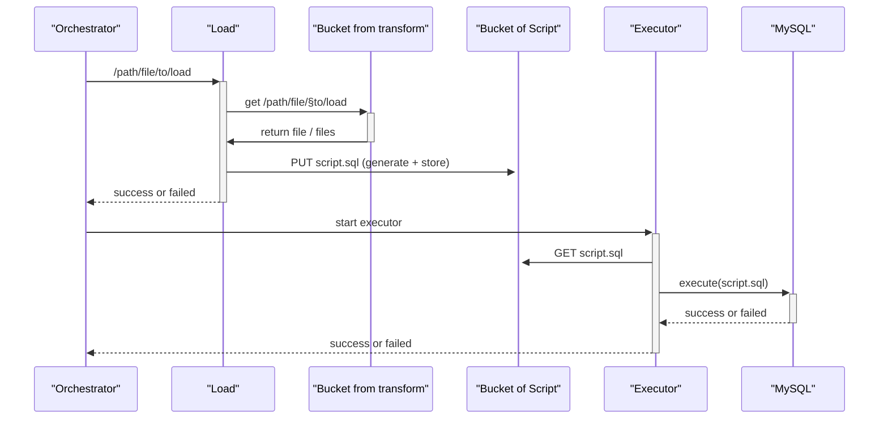

# RIA2-Load
## Structure

## Question
- Le load doit recevoir les info de manière asynchrone ?
    - exemple : L'orchestrator transmet un path de fichier à récuperer du bucket, le Load le charge et génère un script SQL. Il acquite la fin du processus à l'orchestrateur.
- L'orchestrateur me transmet de path de fichier ou des dossier (les deux ?)