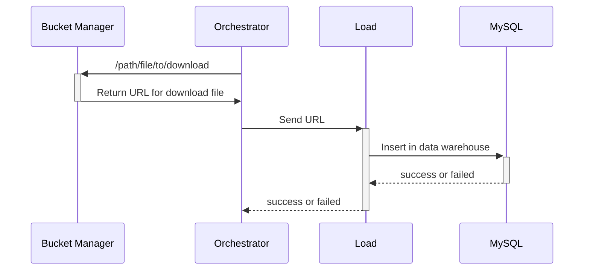

# RIA2-Load
## Fonctionnalités

- Récuperer et télécharger le fichier via l'url du bucket manager.
- Traduction des données JSON en SQL
    - Définir table cible + colonnes/types + clé unique
    - Lire/valider le JSON (champs, types, nulls)
    - Aplatir/normaliser les données (dates, bool, defaults)
    - Générer `INSERT` (et `ON DUPLICATE KEY UPDATE` si besoin)
    - Écrire `script.sql` + `metadata.json` (run_id, counts, hash)
    - Exécuter + contrôler (transaction, rowcount, logs)

---

## Techno
- Java Spring Boot
- MariaDB (MySQL)

## Structure V2 (12.02.2026)


## Description

Bucket Adapter is a REST microservice built with Spring Boot. Its goal is to communicate with multiple cloud providers  
through a common interface and a Factory-based adapter selection.

The application exposes a REST API. The current AWS and GCP implementations support:

- uploading objects (file content)
- downloading objects
- updating existing objects (overwrite)
- deleting objects (single object or recursive prefix deletion)
- listing bucket contents (objects and prefixes)
- generating temporary shareable URLs (pre-signed URLs)

## Getting Started

### Documentation

You must run the application (see Deployment section) in order to access the documentation.
The application runs under the `/api` context path (`server.servlet.context-path=/api`) and uses the
port configured by `SEREVER_PORT`.

Examples:

- Local run with the sample `.env` (`SEREVER_PORT=8090`): `http://localhost:8090/api/swagger-ui/index.html`
- Docker run without overriding the port (compose default): `http://localhost:8080/api/swagger-ui/index.html`

Video of kanban :
https://youtu.be/awYhGX692GE

### Prerequisites

The following tools and dependencies are required:

* IDE used IntelliJ `2025.3.1`

* **Language / Runtime**
    * Java JDK 21 `openjdk 21.0.9 2025-10-21`
    * OpenJDK Runtime Environment `(build 21.0.9)`
    * JVM compatible with Java 21

* **Frameworks & Libraries**
    * Main frameworks/libraries used by the project (see `pom.xml` for the exact versions)
    * Spring Boot
    * Spring Framework
    * AWS SDK v2 (S3, Presigner)
    * Google Cloud Storage SDK
    * JUnit 5
    * Mockito

* **Build & Dependency Management**
    * Maven (`mvn`) or Maven Wrapper (`./mvnw`, recommended for reproducible builds)

* **Supported OS (tested)**
    * MacOS (`Tahoe 26.1`)

* **Cloud Providers**
    * AWS S3 (currently implemented)
    * Google Cloud Storage (implemented)
    * Azure Blob Storage (planned)

* **Virtualization**
    * Docker version 28.5.1, build e180ab8

---  

### Configuration

#### Environment variables / system properties

The application relies on external configuration to select the storage provider and access the bucket.

1. Copy the `.env.exemple` file to a `.env` file using this command : `cp .env.exemple .env`.
2. Configure variables in `.env` file.

Default application port (override if needed):

```bash
# Note: the project currently uses SEREVER_PORT (typo kept in config/code)
SEREVER_PORT=8090
```

#### AWS configuration

Required variables:

```bash  
AWS_REGION=your-region  
AWS_ACCESS_KEY_ID=your-access-key-id  
AWS_SECRET_ACCESS_KEY=your-secret-access-key  
```  

Provider selection:

```bash  
PROVIDER_IMPL=AWS  
```  

#### GCP configuration

Required variables :

```bash  
GOOGLE_CLOUD_PROJECT=your-project-id  
GOOGLE_APPLICATION_CREDENTIALS=./path-to-credentials.json  
```  

> Note : You'll have to put the path of your `credentials.json` file in the `GOOGLE_APPLICATION_CREDENTIALS`
> environment  
> variable.

Provider selection:

```bash  
PROVIDER_IMPL=GCP  
```  

#### Azure configuration

For next feature.

## Deployment

### On dev environment

#### Build the project

This command runs the full Maven lifecycle used by the project (compile, tests, packaging,
Checkstyle, and SpotBugs):

```bash
mvn clean install
```

#### Run tests

```bash
mvn test
```

2. Check code coverage (CLI)

```bash
mvn clean \
  org.jacoco:jacoco-maven-plugin:0.8.12:prepare-agent \
  test \
  org.jacoco:jacoco-maven-plugin:0.8.12:report
```

Generated report: `target/site/jacoco/index.html`

#### Run the application

```bash
mvn spring-boot:run
```

### On integration environment

#### Maven build

```bash
# Make sure Maven wrapper is executable
chmod +x mvnw

# Clean and compile, skip tests
mvn clean package -DskipTests

# (Optional) Run tests
mvn test
```

#### Docker build & run

```bash
# Build Docker image
docker compose up --build
```

### How to use the application ?

#### API

##### Insomnia

You can use Insomnia for commands. Import the Insomnia_2026-01-09.yaml file into your Insomnia application.
The exported file contains sample values. For better reusability after import:

- create an Insomnia environment with variables such as `base_url`, `remote`, and `expirationTime`
- update requests to use those variables instead of hard-coded values
- adapt the host/port to your local configuration (`SEREVER_PORT`)

##### Curl

To use the API you can read this [documentation](docs/curl-route.md).

**How to update the API documentation ?**

To update/export the OpenAPI documentation, first run the project using **Maven** or **Docker**:

```bash
# Maven
mvn spring-boot:run

# Docker
docker compose up --build
```

Then export the OpenAPI definition (JSON) from the running application:

```bash
curl "http://localhost:${SEREVER_PORT:-8090}/api/v3/api-docs" -o docs/openapi.json
```

You can also open the interactive UI in your browser:
`http://localhost:${SEREVER_PORT:-8090}/api/swagger-ui/index.html`

## Directory structure

```bash
.
├── Dockerfile
├── HELP.md
├── Insomnia_2026-01-09.yaml
├── README.md
├── bi1-julien.json
├── checkstyle.xml
├── docker-compose.yml
├── docs
├── mvnw
├── mvnw.cmd
├── package-lock.json
├── pom.xml
├── qodana.yaml
├──  src
│    ├── main
│    │   ├── java
│    │   │   └── com
│    │   │       └── bucketadapter
│    │   │           ├── BucketAdapterApplication.java
│    │   │           ├── BucketAdapterFactory.java
│    │   │           ├── BucketController.java
│    │   │           ├── BucketService.java
│    │   │           ├── adapter
│    │   │           │   ├── BucketAdapter.java
│    │   │           │   └── impl
│    │   │           │       ├── AWSBucketAdapterImpl.java
│    │   │           │       ├── AZUREBucketAdapterImpl.java
│    │   │           │       └── GCPBucketAdapterImpl.java
│    │   │           ├── bucketadapterexceptions
│    │   │           │   ├── ApiExceptionHandler.java
│    │   │           │   ├── BucketObjectNotFoundException.java
│    │   │           │   ├── BucketOperationException.java
│    │   │           │   └── InvalidBucketPathException.java
│    │   │           ├── config
│    │   │           │   ├── AwsClientConfig.java
│    │   │           │   ├── DotenvInitializer.java
│    │   │           │   ├── GcpStorageConfig.java
│    │   │           │   └── OpenApiConfig.java
│    │   │           └── helpers
│    │   │               └── AdapterHelper.java
│    │   └── resources
│    │       ├── application.properties
│    │       ├── static
│    │       └── templates
│    └── test
│        └── java
│            └── com
│                └── bucketadapter
│                    └── bucket_adapter
│                        ├── AWSBucketAdapterTest.java
│                        └── GCPStorageAdapterTest.java
└──  target

```

## Collaborate

### Proposing a new feature

- Create an **issue** describing the feature or bug
- Submit a **Pull Request** linked to the issue

### Commit convention

This project follows [Conventional Commits](https://www.conventionalcommits.org/en/v1.0.0/)

Examples :

```bash
feat: add GCP bucket adapter
fix: handle S3 presigner exception
test: add unit tests for recursive delete
```

### Git branch workflow

This projects use the [Gitflow workflow](https://www.atlassian.com/git/tutorials/comparing-workflows/gitflow-workflow)

Examples :

```bash
feature/implement-aws-s3
release/1.0.0
hotfix/fix-servor-error-on-s3-upload
```

## License

This project is licensed under the **MIT License**.

See the `LICENSE` file for the full text.

## Contact

For questions or contributions:

- GitHub Issues
- Pull Request discussions

For personal interactions:

- Schneider Julien
- julienschneider@eduvaud.ch
