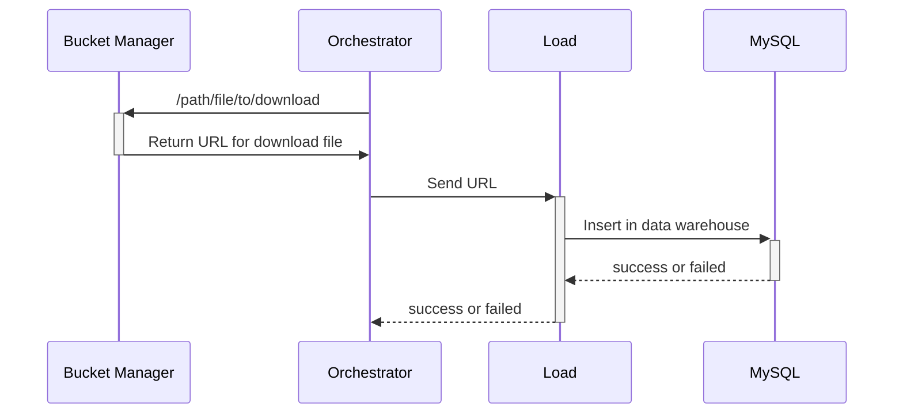

# RIA2-Load
## Fonctionnalités

- Récuperer et télécharger le fichier via l'url du bucket manager.
- Traduction des données JSON en SQL
    - Définir table cible + colonnes/types + clé unique
    - Lire/valider le JSON (champs, types, nulls)
    - Aplatir/normaliser les données (dates, bool, defaults)
    - Générer `INSERT` (et `ON DUPLICATE KEY UPDATE` si besoin)
    - Écrire `script.sql` + `metadata.json` (run_id, counts, hash)
    - Exécuter + contrôler (transaction, rowcount, logs)

---

## Techno
- Java Spring Boot
- MariaDB (MySQL)

## Structure V2 (12.02.2026)
